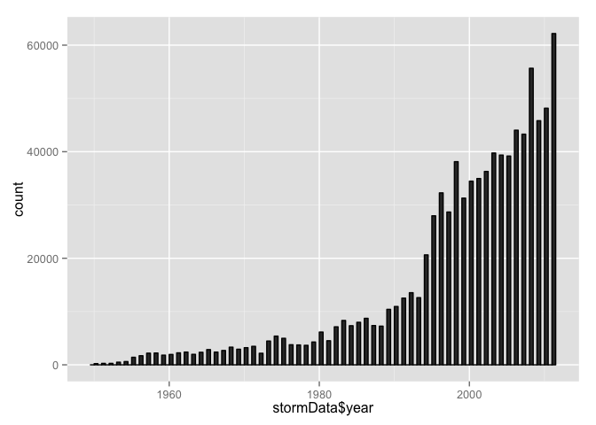
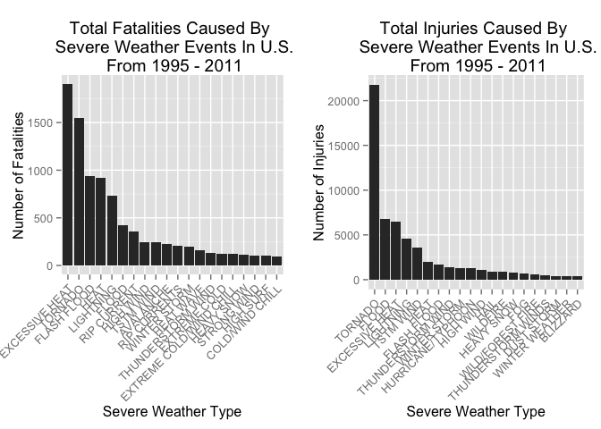
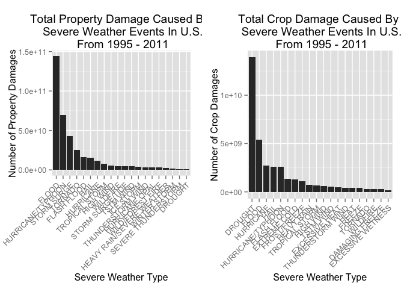

# Reproducible Research: Peer Assessment 2
Created by H.Wang on November 21, 2015

## Title
Impact of Severe Weather Events on Public Health and Economy in the United States

## Synonpsis  
The project is aimed to analyze the impact of different weather events on public health and economy based on U.S. National Oceanic and Atmospheric Administration's (NOAA) storm database which events were recorded from 1950 to 2011. The analysis will around the estimates of fatalities, injuries, property damage to decide which types of event are most harmful with respect to the population health and economy. 

## Basic Settings

```r
library(ggplot2)
library(plyr)
library(gridExtra)
```

## Loading and preprocessing the data

```r
# 1. Load the data
setwd("~/Desktop/Downloads/R/Reproducible Research") #set directory

if (!"stormData.csv.bz2" %in% dir("./")) {
    download.file("http://d396qusza40orc.cloudfront.net/repdata%2Fdata%2FStormData.csv.bz2", destfile =
                 "stormData.csv.bz2")
}

if(!"stormData" %in% ls()) {
        stormData <- read.csv("stormData.csv.bz2", sep = ",")
}

dim(stormData)
```

```
## [1] 902297     37
```

```r
summary(stormData)
```

```
##     STATE__                  BGN_DATE             BGN_TIME     
##  Min.   : 1.0   5/25/2011 0:00:00:  1202   12:00:00 AM: 10163  
##  1st Qu.:19.0   4/27/2011 0:00:00:  1193   06:00:00 PM:  7350  
##  Median :30.0   6/9/2011 0:00:00 :  1030   04:00:00 PM:  7261  
##  Mean   :31.2   5/30/2004 0:00:00:  1016   05:00:00 PM:  6891  
##  3rd Qu.:45.0   4/4/2011 0:00:00 :  1009   12:00:00 PM:  6703  
##  Max.   :95.0   4/2/2006 0:00:00 :   981   03:00:00 PM:  6700  
##                 (Other)          :895866   (Other)    :857229  
##    TIME_ZONE          COUNTY           COUNTYNAME         STATE       
##  CST    :547493   Min.   :  0.0   JEFFERSON :  7840   TX     : 83728  
##  EST    :245558   1st Qu.: 31.0   WASHINGTON:  7603   KS     : 53440  
##  MST    : 68390   Median : 75.0   JACKSON   :  6660   OK     : 46802  
##  PST    : 28302   Mean   :100.6   FRANKLIN  :  6256   MO     : 35648  
##  AST    :  6360   3rd Qu.:131.0   LINCOLN   :  5937   IA     : 31069  
##  HST    :  2563   Max.   :873.0   MADISON   :  5632   NE     : 30271  
##  (Other):  3631                   (Other)   :862369   (Other):621339  
##                EVTYPE         BGN_RANGE           BGN_AZI      
##  HAIL             :288661   Min.   :   0.000          :547332  
##  TSTM WIND        :219940   1st Qu.:   0.000   N      : 86752  
##  THUNDERSTORM WIND: 82563   Median :   0.000   W      : 38446  
##  TORNADO          : 60652   Mean   :   1.484   S      : 37558  
##  FLASH FLOOD      : 54277   3rd Qu.:   1.000   E      : 33178  
##  FLOOD            : 25326   Max.   :3749.000   NW     : 24041  
##  (Other)          :170878                      (Other):134990  
##          BGN_LOCATI                  END_DATE             END_TIME     
##               :287743                    :243411              :238978  
##  COUNTYWIDE   : 19680   4/27/2011 0:00:00:  1214   06:00:00 PM:  9802  
##  Countywide   :   993   5/25/2011 0:00:00:  1196   05:00:00 PM:  8314  
##  SPRINGFIELD  :   843   6/9/2011 0:00:00 :  1021   04:00:00 PM:  8104  
##  SOUTH PORTION:   810   4/4/2011 0:00:00 :  1007   12:00:00 PM:  7483  
##  NORTH PORTION:   784   5/30/2004 0:00:00:   998   11:59:00 PM:  7184  
##  (Other)      :591444   (Other)          :653450   (Other)    :622432  
##    COUNTY_END COUNTYENDN       END_RANGE           END_AZI      
##  Min.   :0    Mode:logical   Min.   :  0.0000          :724837  
##  1st Qu.:0    NA's:902297    1st Qu.:  0.0000   N      : 28082  
##  Median :0                   Median :  0.0000   S      : 22510  
##  Mean   :0                   Mean   :  0.9862   W      : 20119  
##  3rd Qu.:0                   3rd Qu.:  0.0000   E      : 20047  
##  Max.   :0                   Max.   :925.0000   NE     : 14606  
##                                                 (Other): 72096  
##            END_LOCATI         LENGTH              WIDTH         
##                 :499225   Min.   :   0.0000   Min.   :   0.000  
##  COUNTYWIDE     : 19731   1st Qu.:   0.0000   1st Qu.:   0.000  
##  SOUTH PORTION  :   833   Median :   0.0000   Median :   0.000  
##  NORTH PORTION  :   780   Mean   :   0.2301   Mean   :   7.503  
##  CENTRAL PORTION:   617   3rd Qu.:   0.0000   3rd Qu.:   0.000  
##  SPRINGFIELD    :   575   Max.   :2315.0000   Max.   :4400.000  
##  (Other)        :380536                                         
##        F               MAG            FATALITIES          INJURIES        
##  Min.   :0.0      Min.   :    0.0   Min.   :  0.0000   Min.   :   0.0000  
##  1st Qu.:0.0      1st Qu.:    0.0   1st Qu.:  0.0000   1st Qu.:   0.0000  
##  Median :1.0      Median :   50.0   Median :  0.0000   Median :   0.0000  
##  Mean   :0.9      Mean   :   46.9   Mean   :  0.0168   Mean   :   0.1557  
##  3rd Qu.:1.0      3rd Qu.:   75.0   3rd Qu.:  0.0000   3rd Qu.:   0.0000  
##  Max.   :5.0      Max.   :22000.0   Max.   :583.0000   Max.   :1700.0000  
##  NA's   :843563                                                           
##     PROPDMG          PROPDMGEXP        CROPDMG          CROPDMGEXP    
##  Min.   :   0.00          :465934   Min.   :  0.000          :618413  
##  1st Qu.:   0.00   K      :424665   1st Qu.:  0.000   K      :281832  
##  Median :   0.00   M      : 11330   Median :  0.000   M      :  1994  
##  Mean   :  12.06   0      :   216   Mean   :  1.527   k      :    21  
##  3rd Qu.:   0.50   B      :    40   3rd Qu.:  0.000   0      :    19  
##  Max.   :5000.00   5      :    28   Max.   :990.000   B      :     9  
##                    (Other):    84                     (Other):     9  
##       WFO                                       STATEOFFIC    
##         :142069                                      :248769  
##  OUN    : 17393   TEXAS, North                       : 12193  
##  JAN    : 13889   ARKANSAS, Central and North Central: 11738  
##  LWX    : 13174   IOWA, Central                      : 11345  
##  PHI    : 12551   KANSAS, Southwest                  : 11212  
##  TSA    : 12483   GEORGIA, North and Central         : 11120  
##  (Other):690738   (Other)                            :595920  
##                                                                                                                                                                                                     ZONENAMES     
##                                                                                                                                                                                                          :594029  
##                                                                                                                                                                                                          :205988  
##  GREATER RENO / CARSON CITY / M - GREATER RENO / CARSON CITY / M                                                                                                                                         :   639  
##  GREATER LAKE TAHOE AREA - GREATER LAKE TAHOE AREA                                                                                                                                                       :   592  
##  JEFFERSON - JEFFERSON                                                                                                                                                                                   :   303  
##  MADISON - MADISON                                                                                                                                                                                       :   302  
##  (Other)                                                                                                                                                                                                 :100444  
##     LATITUDE      LONGITUDE        LATITUDE_E     LONGITUDE_    
##  Min.   :   0   Min.   :-14451   Min.   :   0   Min.   :-14455  
##  1st Qu.:2802   1st Qu.:  7247   1st Qu.:   0   1st Qu.:     0  
##  Median :3540   Median :  8707   Median :   0   Median :     0  
##  Mean   :2875   Mean   :  6940   Mean   :1452   Mean   :  3509  
##  3rd Qu.:4019   3rd Qu.:  9605   3rd Qu.:3549   3rd Qu.:  8735  
##  Max.   :9706   Max.   : 17124   Max.   :9706   Max.   :106220  
##  NA's   :47                      NA's   :40                     
##                                            REMARKS           REFNUM      
##                                                :287433   Min.   :     1  
##                                                : 24013   1st Qu.:225575  
##  Trees down.\n                                 :  1110   Median :451149  
##  Several trees were blown down.\n              :   568   Mean   :451149  
##  Trees were downed.\n                          :   446   3rd Qu.:676723  
##  Large trees and power lines were blown down.\n:   432   Max.   :902297  
##  (Other)                                       :588295
```

The data has total up 902297 rows and 37 columns, most of the event beginning date were recorded in year 2011, following up next I am going to plot histogram and then analyze data based on the events frequency.


```r
# 2. Process/Transform the data
stormData$year <- as.numeric(format(as.Date(stormData$BGN_DATE, format = "%m/%d/%Y %H:%M:%S"), "%Y")) ## add one more column to record events start years

ggplot(data = stormData, aes(x = stormData$year )) + geom_histogram(aes(y = ..count..),binwidth = 0.5, color = I("black")) 
```

 

```r
new_stormData <- stormData[stormData$year >= 1995, ] #create subset data with year > 1995
dim(new_stormData)
```

```
## [1] 681500     38
```

In the earlier years few events are recorded, most likely due to a lack of good records. Starting from year 1995 the events tracked start to increase significantly. Thus, I will use the subset of the data after 1995 to get most out of good records.

## Analysis of weather events impact on population health
According to the summary of data, columns **FATALITIES** and **INJURIES** are related to population health, thus I am going to check the fatalities and injuries that are caused by severe weather, list the top 20 most severe type of weather events. 

```r
data_extraction <- function(fieldname, top = 20, dataset = stormData) {
        index <- which(colnames(dataset) == fieldname)
        field <- aggregate(dataset[, index], by = list(dataset$EVTYPE), FUN = "sum")
        names(field) <- c("EVTYPE", fieldname)
        field <- arrange(field, field[, 2], decreasing = T)
        field <- head(field, n = top)
        field <- within(field, EVTYPE <- factor(x = EVTYPE, levels = field$EVTYPE))
        return(field)
}

fatalities <- data_extraction("FATALITIES", dataset = new_stormData)
head(fatalities) # display fatalities data
```

```
##           EVTYPE FATALITIES
## 1 EXCESSIVE HEAT       1903
## 2        TORNADO       1545
## 3    FLASH FLOOD        934
## 4           HEAT        924
## 5      LIGHTNING        729
## 6          FLOOD        423
```

```r
injuries <- data_extraction("INJURIES", dataset = new_stormData)
head(injuries) # display injuries data
```

```
##           EVTYPE INJURIES
## 1        TORNADO    21765
## 2          FLOOD     6769
## 3 EXCESSIVE HEAT     6525
## 4      LIGHTNING     4631
## 5      TSTM WIND     3630
## 6           HEAT     2030
```

```r
# plot weather events distribution correspond to numbers of injuries as well as fatalities
fatalities_plot <- qplot(EVTYPE, data = fatalities, weight = FATALITIES, geom = "bar", binwidth = 1) + 
    scale_y_continuous("Number of Fatalities") + 
    theme(axis.text.x = element_text(angle = 45, 
    hjust = 1)) + xlab("Severe Weather Type") + 
    ggtitle("Total Fatalities Caused By \n Severe Weather Events In U.S.\n From 1995 - 2011")

injuries_plot <- qplot(EVTYPE, data = injuries, weight = INJURIES, geom = "bar", binwidth = 1) + 
    scale_y_continuous("Number of Injuries") + 
    theme(axis.text.x = element_text(angle = 45, 
    hjust = 1)) + xlab("Severe Weather Type") + 
    ggtitle("Total Injuries Caused By \n Severe Weather Events In U.S.\n From 1995 - 2011")

grid.arrange(fatalities_plot, injuries_plot, ncol = 2) #merge plots 
```

 

```r
options(scipen = 1) # turn off scientific notation
```

Based on the above histograms, the fatalities was mostly caused by **excessive heat** (with 1903 records) and **tornado** (with 1545 records), while injuries was mostly caused by **tornato** (with 2.1765\times 10^{4} records) in the United States from 1995 to 2011.

## Analysis of weather events impact on economy
The data in column **PROPDMG** and **CROPDMG** need to be converted into comparable numerical forms according to the meaning of units described in the code book ([Storm Events](http://ire.org/nicar/database-library/databases/storm-events/)). Both **`PROPDMGEXP`** and **`CROPDMGEXP`** columns record a multiplier for each observation where we have Hundred (H), Thousand (K), Million (M) and Billion (B).

```r
data_conversion <- function(dataset = new_stormData, fieldname, new_fieldname) {
    totalLen <- dim(dataset)[2]
    index <- which(colnames(dataset) == fieldname)
    dataset[, index] <- as.character(dataset[, index])
    logic <- !is.na(toupper(dataset[, index]))
    dataset[logic & toupper(dataset[, index]) == "B", index] <- "9"
    dataset[logic & toupper(dataset[, index]) == "M", index] <- "6"
    dataset[logic & toupper(dataset[, index]) == "K", index] <- "3"
    dataset[logic & toupper(dataset[, index]) == "H", index] <- "2"
    dataset[logic & toupper(dataset[, index]) == "", index] <- "0"
    dataset[, index] <- as.numeric(dataset[, index])
    dataset[is.na(dataset[, index]), index] <- 0  ## NA or "" are in 0 
    dataset <- cbind(dataset, dataset[, index - 1] * 10^dataset[, index])
    names(dataset)[totalLen + 1] <- new_fieldname
    return(dataset)
}

new_stormData <- data_conversion(new_stormData, "PROPDMGEXP", "PROPDMG_actuals")
```

```
## Warning in data_conversion(new_stormData, "PROPDMGEXP", "PROPDMG_actuals"):
## NAs introduced by coercion
```

```r
new_stormData <- data_conversion(new_stormData, "CROPDMGEXP", "CROPDMG_actuals")
```

```
## Warning in data_conversion(new_stormData, "CROPDMGEXP", "CROPDMG_actuals"):
## NAs introduced by coercion
```

```r
property_damages <- data_extraction("PROPDMG_actuals", dataset = new_stormData) 
head(property_damages) # display property damage data
```

```
##              EVTYPE PROPDMG_actuals
## 1             FLOOD    144022037057
## 2 HURRICANE/TYPHOON     69305840000
## 3       STORM SURGE     43193536000
## 4           TORNADO     24935939545
## 5       FLASH FLOOD     16047794571
## 6              HAIL     15048722103
```

```r
crop_damages <- data_extraction("CROPDMG_actuals", dataset = new_stormData) 
head(crop_damages) # display crop damage data
```

```
##              EVTYPE CROPDMG_actuals
## 1           DROUGHT     13922066000
## 2             FLOOD      5422810400
## 3         HURRICANE      2741410000
## 4              HAIL      2614127070
## 5 HURRICANE/TYPHOON      2607872800
## 6       FLASH FLOOD      1343915000
```

```r
# plot weather events distribution correspond to numbers of injuries as well as fatalities
PROPDMG_plot <- qplot(EVTYPE, data = property_damages, weight = PROPDMG_actuals, geom = "bar", binwidth = 1) + scale_y_continuous("Number of Property Damages") + theme(axis.text.x = element_text(angle = 45, hjust = 1)) + xlab("Severe Weather Type") + ggtitle("Total Property Damage Caused By \n Severe Weather Events In U.S.\n From 1995 - 2011")

CROPDMG_plot <- qplot(EVTYPE, data = crop_damages, weight = CROPDMG_actuals, geom = "bar", binwidth = 1) + scale_y_continuous("Number of Crop Damages") + theme(axis.text.x = element_text(angle = 45, hjust = 1)) + xlab("Severe Weather Type") + ggtitle("Total Crop Damage Caused By \n Severe Weather Events In U.S.\n From 1995 - 2011")

grid.arrange(PROPDMG_plot, CROPDMG_plot, ncol = 2) #merge plots 
```

 

```r
options(scipen = 999) # turn on scientific notation
```
Similarly, the property damage was mostly caused by **flood** (with 1.4402204\times 10^{11} records) and **hurricane/typhoon** (with 6.930584\times 10^{10} records), while crop damage was mostly caused by **drought** (with 1.3922066\times 10^{10} records) and **flood** (with 5.4228104\times 10^{9} records) in the United States from 1995 to 2011.

## Conclusion  
In sum, weather events such as **excessive heat** and **tornado** are amongst highest destructive factors with respect to population health, while **flood**, **drought**, and **hurricane/typhoon** cause the greatest economic consequences.
